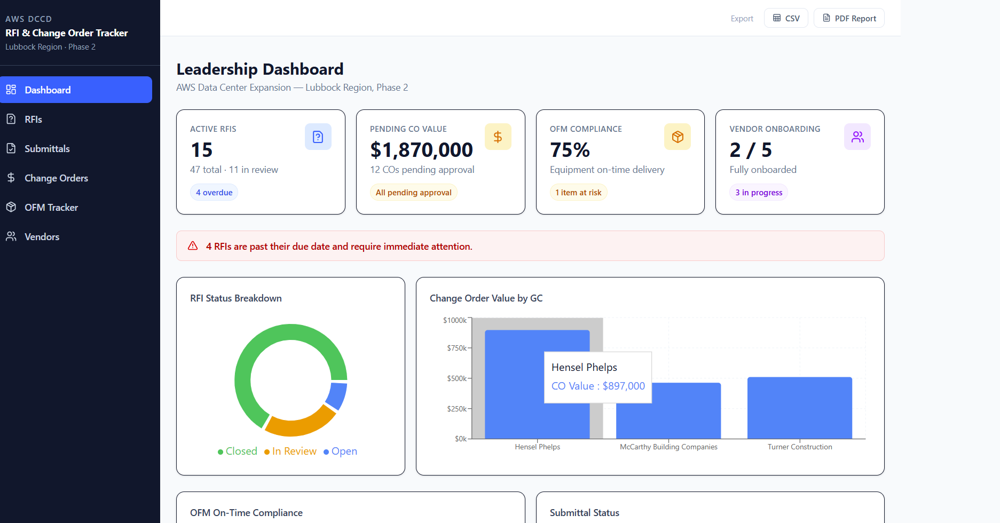
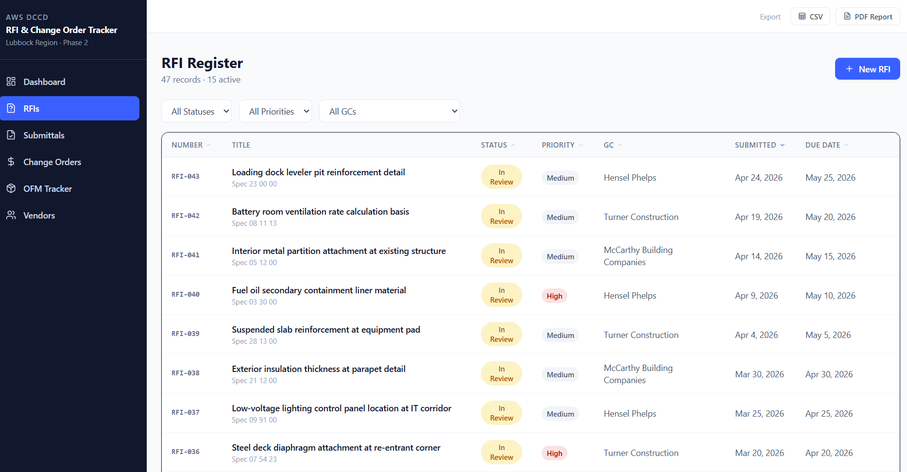
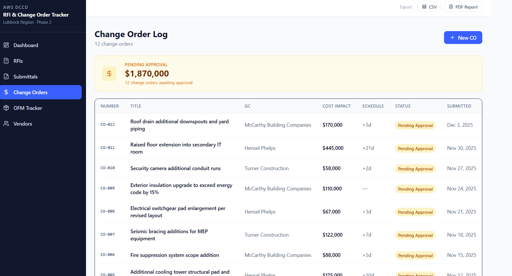
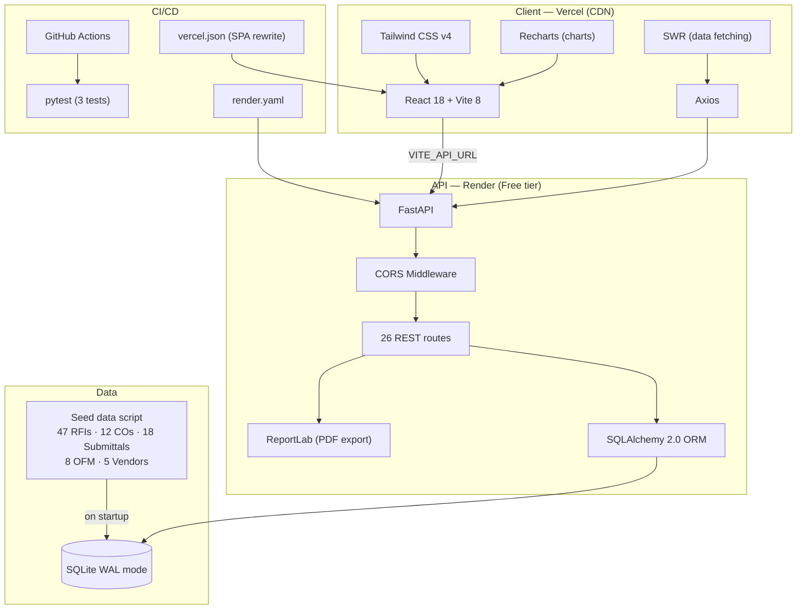
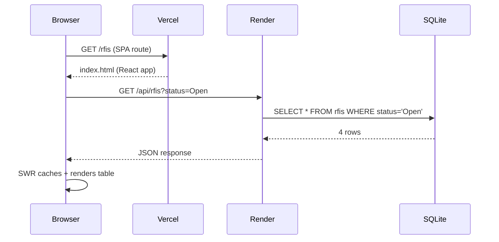

# RFI & Change Order Tracker

**Live demo:** https://aws-construction-tracker.vercel.app

A full-stack construction project management tool built to demonstrate production-grade engineering for AWS Data Center expansion projects. Tracks RFIs, submittals, change orders, OFM equipment, and vendor onboarding — with CSV/PDF export on every module.

---

## Screenshots

### Leadership Dashboard


### RFI Management


### Change Orders ($1.87M running total)


---

## Architecture



### Request flow



---

## Tech stack

| Layer | Technology | Why |
|---|---|---|
| Frontend | React 18 + Vite 8 | Fast HMR, tree-shaking, production-ready |
| Styling | Tailwind CSS v4 | Zero config — `@import "tailwindcss"` only |
| Charts | Recharts | Composable, React-native charting |
| Data fetching | SWR + Axios | Stale-while-revalidate caching |
| Backend | FastAPI | Auto Swagger docs from Pydantic schemas |
| ORM | SQLAlchemy 2.0 | Framework-agnostic, production-scalable |
| Database | SQLite (WAL) | Portfolio demo; swap to PostgreSQL via `DATABASE_URL` |
| PDF export | ReportLab | Zero native deps — works on Linux/Windows/Docker |
| CI | GitHub Actions | pytest on every push |
| Backend deploy | Render | render.yaml → auto-deploy from master |
| Frontend deploy | Vercel | vercel.json SPA rewrite → auto-deploy from master |

---

## Seed data

| Entity | Count | Key detail |
|---|---|---|
| RFIs | 47 | 32 Closed · 11 In Review · 4 Open overdue |
| Submittals | 18 | 14 Approved · 3 Pending · 1 Rejected |
| Change Orders | 12 | All Pending Approval · sum = **$1,870,000** |
| OFM Items | 8 | 6 Green · 1 Amber (XFMR-01) · 1 Red (PDU-B1) |
| Vendors | 5 | 2 Onboarded · 2 Orientation Pending · 1 NDA Outstanding |

---

## Run locally

```bash
# Terminal 1 — Backend
cd backend
py -3.12 -m venv venv
./venv/Scripts/activate
pip install -r requirements.txt
python seed_data.py
uvicorn app.main:app --reload --port 8000

# Terminal 2 — Frontend
cd frontend
npm install
npm run dev
# → http://127.0.0.1:5173
```

API docs auto-generated at `http://127.0.0.1:8000/docs`

---

## Project structure

```
aws-construction-tracker/
├── .github/workflows/test.yml     # CI: pytest on push
├── backend/
│   ├── app/
│   │   ├── main.py                # FastAPI app, CORS, lifespan
│   │   ├── config.py              # DATABASE_URL, FRONTEND_ORIGINS
│   │   ├── database.py            # SQLAlchemy engine + get_db
│   │   ├── models/                # SQLAlchemy ORM models (5)
│   │   ├── schemas/               # Pydantic request/response schemas
│   │   └── routers/               # 26 routes across 7 modules
│   ├── seed_data.py               # Full demo dataset (runs on start)
│   ├── tests/test_health.py       # pytest integration tests
│   ├── requirements.txt
│   └── render.yaml                # Render deploy config
└── frontend/
    ├── src/
    │   ├── api/client.js          # Axios base client + all API calls
    │   ├── pages/                 # Dashboard, RFIs, Submittals, COs, OFM, Vendors
    │   └── components/            # AppShell, modals, tables, charts
    ├── vite.config.js             # Proxy: 127.0.0.1:8000 (local dev)
    └── vercel.json                # SPA rewrite for client-side routing
```

---

## Key engineering decisions

**SQLite → PostgreSQL migration path:** `DATABASE_URL` env var is the only change needed. SQLAlchemy abstracts the driver completely. This is the right portfolio answer — shows production thinking without over-engineering a demo.

**Pydantic v2 pinned (`==2.12.5`):** First wheel released with Python 3.14 support. Required because the backend runs on Python 3.14 locally. Actions CI uses 3.12 (stable for production).

**Tailwind v4 zero-config:** `@import "tailwindcss"` in `index.css` — no `tailwind.config.js`, no PostCSS config. Vite plugin handles everything. Newer approach that interviewers may not have seen.

**ReportLab over WeasyPrint:** WeasyPrint requires `libcairo`/`libpango` native libs — incompatible with Render's free tier. ReportLab is pure Python.

---

## Future roadmap

| Version | Feature |
|---|---|
| v1.1 | Toast notifications, inline CO editing, RFI detail modal |
| v1.2 | JWT auth, role-based access (PM read-only / PE full edit) |
| v2.0 | PostgreSQL + Alembic, S3 attachments, SendGrid alerts, WebSocket dashboard |
| v3.0 | AWS ECS Fargate, RDS Multi-AZ, CloudFront + S3 frontend, Cognito SSO |
